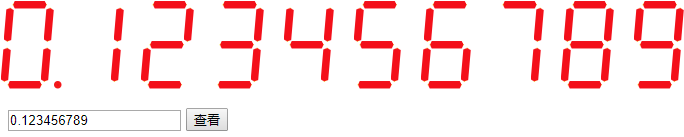

# 数字显示控件

    数字显示控件可以用来显示类似于数字时钟或电气仪表的数字字符。

    本控件提供了设置字符数据、字体大小、字间距百分比以及字符皮肤等参数。

# 实例
```
$("#div_view_digital").digital({
    "num": num,
    "size": 50,
    "spacing": 0.4,
    "skin": "default"
 });
 ```

 # 参数

－字符数据

－字体大小

－字间距百分比

－字体的皮肤

# 运行效果


使用该控件需要引入jQuery.js框架。
